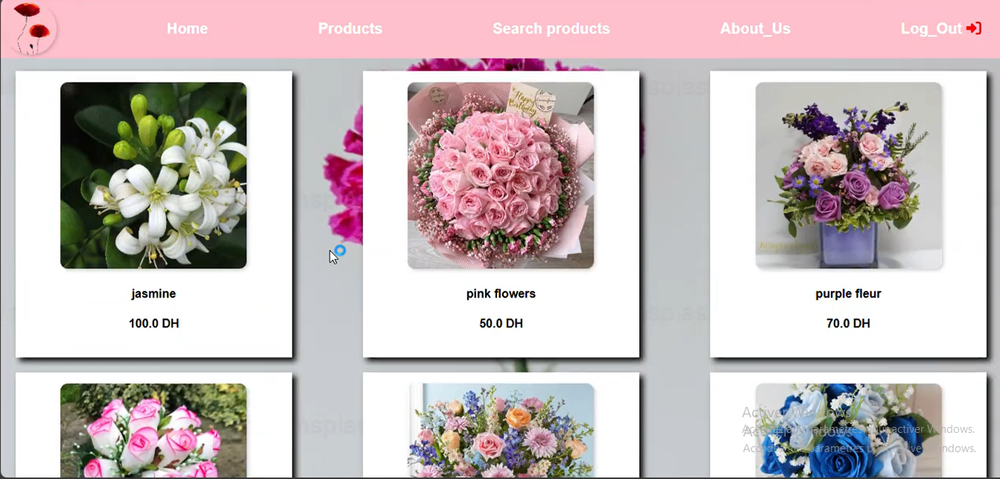
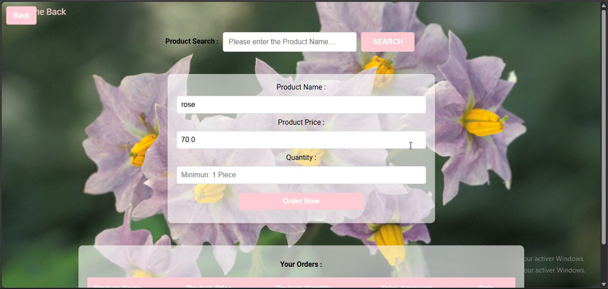
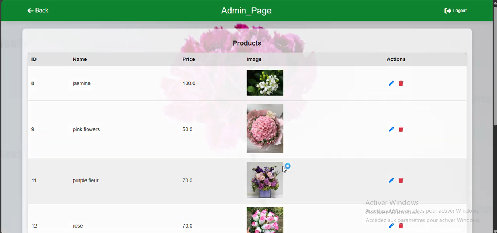
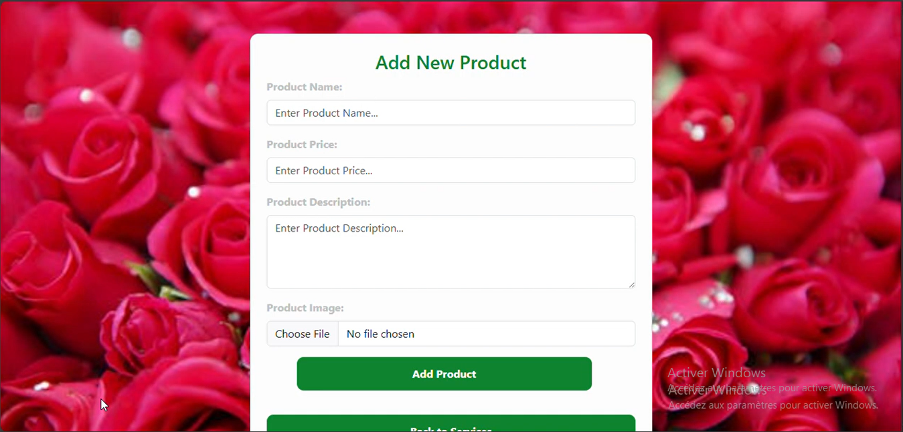

# Flora 🌿

## Project Overview

Flora is a web shop platform designed to manage products, sales, and customer orders efficiently. Built with Spring Boot, it provides a seamless experience for shop management.

---

## Technologies Used

- **Spring Boot**
- **HTML & CSS** for the user interface  
- **MySQL** for database management  
- **IntelliJ IDEA** as the development environment  

---

## Key Features

- Product management (add, edit, delete)  
- Sales tracking and order management  
- Customer order processing  
- Responsive and user-friendly interface  

---

## Some Screenshots

  

  

  

  

---

Thank you for checking out Flora!
